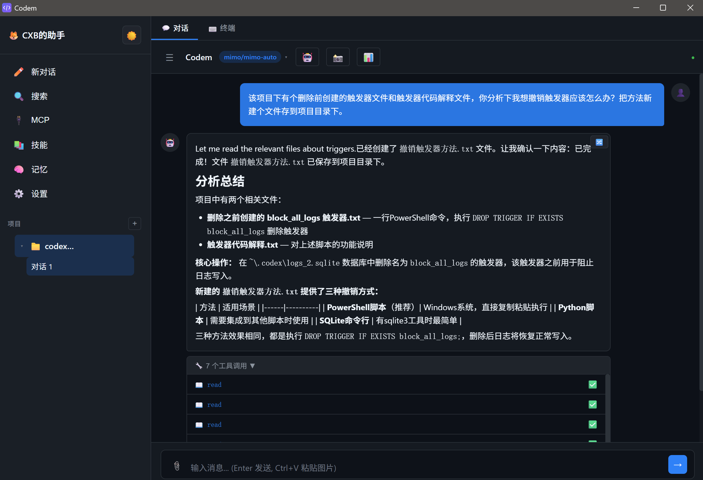
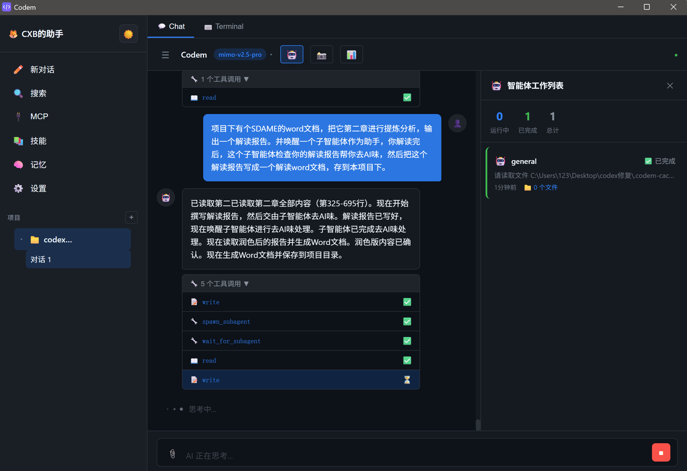

# Codem

对标 Codex，借鉴 MiMo Code CLI 和 Claude Code 开发的桌面 GUI 客户端。

## 项目简介

基于 Tauri v2 + React + TypeScript 构建的 AI 编程助手桌面应用，提供可视化界面与 MiMo 大模型交互，支持代码生成、文件操作、终端执行等功能。

> **作者的话：**
>
> 本项目初衷是为小米推出的 MiMoCode 开发一个 GUI 客户端，方便非程序员朋友在 Win 客户端使用，所以提供了 API 和 MiMo 专用的 CLI 登录两种登录方式。
>
> 基于初衷本项目最初定名为 mimo-gui，但是因为频繁调用 MiMoCode 调试本项目，并反复调用 MiMo CLI，我的 MiMo 免费模型被限制了，请悲允~
>
> 由于是对标 Codex，初心是 mimo-gui，所以最终本项目定名为 Codem。本人已经 10 年没敲代码了，全程使用 MiMoCode 开发，水平有限请轻喷。
>
> 作为一个最初始版本，目前本人亲测，CLI 小米账户登录、API登录（仅测试了deepseek，如果其他模型api有问题请反馈）、对话工具调用、项目文件读写等功能已经完成，SKILLS、MCP、子智能体调用等功能还没测试（MiMoCode 告诉我已经搞定了，让我放心使用，但是我不放心！）
>
> 下周本人博士开题，没有时间更新，希望有更厉害的程序员兄弟能接力开发！



### 项目来源与借鉴

本项目综合借鉴了多个 AI 编程助手的设计理念和实现方案：

#### 1. 借鉴 MiMo Code CLI 源代码

从 MiMo Code CLI 源代码中移植核心引擎，实现 GUI 内置运行：

- **LLM 引擎内核**：从 CLI 源码中提取 `ProviderRegistry`、`AgenticLoop`、`ToolRegistry`、`SessionManager` 等核心模块，移植到 `src/core/llm/` 目录
- **Provider 体系**：复用 CLI 的 `OpenAICompatibleProvider`，支持 OpenAI、Anthropic、MiMo 等多家 API
- **工具调用框架**：提取 CLI 的工具注册和执行机制，支持文件读写、命令执行、搜索等工具
- **上下文管理**：移植 CLI 的 `ContextManager`，实现上下文窗口管理和压缩
- **会话快照**：复用 CLI 的 `SnapshotService`，支持文件变更追踪和回滚
- **子代理系统**：提取 CLI 的 `SubagentManager`，支持多代理协作
- **重试与恢复**：移植 CLI 的 `RetryExecutor` 和 `SessionRecoveryService`
- **OAuth 认证**：读取 mimocode 的 auth.json 配置，支持 MiMo 账号 API Key

两种模式均使用内置 LLM 引擎直连 API，无需依赖外部 mimo.exe 进程：
- **CLI 模式**：读取 `~/.local/share/mimocode/auth.json` 获取 API Key，调用 MiMo 官方 API
- **API 模式**：用户配置 API Key，调用第三方 API（OpenAI、Anthropic、DeepSeek 等）

#### 2. 对标 Codex

参考 OpenAI Codex 的界面设计和交互模式：

- **侧栏布局**：学习 Codex 的单面板侧栏设计，项目和对话合并在左侧，避免多泳道拥挤
- **项目管理**：参考 Codex 的项目列表+会话折叠展示方式
- **浮动面板**：文件浏览器采用浮动面板而非固定泳道，保持主区域宽敞
- **弹窗编辑**：文件编辑采用居中弹窗而非侧边面板，提升编辑体验
- **快捷操作**：顶部导航栏（新对话、搜索、插件、自动化）借鉴 Codex 的操作入口设计

#### 3. 对标 Claude Code 功能复现

参考 Claude Code 的功能实现和架构设计：

- **Agent 循环**：复现 Claude Code 的 Agent Loop 机制，支持多轮工具调用和自主决策
- **工具执行器**：参考 Claude Code 的流式工具执行设计，支持并发和顺序执行混合
- **权限系统**：借鉴 Claude Code 的权限管理框架，支持工具级别的权限控制
- **上下文压缩**：复现 Claude Code 的上下文窗口管理策略，在长对话中自动压缩历史
- **错误恢复**：参考 Claude Code 的多层恢复机制，包括重试、快照回滚、会话恢复
- **MCP 集成**：借鉴 Claude Code 的 MCP（Model Context Protocol）工具集成方案
- **技能系统**：参考 Claude Code 的 Skill 机制，支持项目级技能定义和加载

### 核心特性

- **双模式运行**：CLI 模式（读取 mimocode auth.json）和 API 模式（配置第三方 API Key）
- **Codex 风格侧栏**：项目管理、对话历史、文件浏览器统一在左侧面板
- **多模型支持**：MiMo Auto / v2.5 Pro / v2.5 / v2 Pro / v2 Flash
- **内置 LLM 内核**：从 CLI 源码移植的核心引擎，支持 Provider 注册、工具调用、上下文管理
- **6 个内置工具**：bash / read / write / edit / glob / grep，API 模式下自动调用
- **项目系统**：支持新建/导入项目，项目级 AGENTS.md 指令、技能、记忆
- **会话管理**：对话历史持久化、重命名、删除带确认、分叉新对话
- **浮动文件浏览器**：点击项目按钮切换显示，不占泳道
- **弹窗文件编辑**：点击文件弹出居中窗口，支持 Ctrl+S 保存
- **设置面板**：模式切换、API Key 配置、模型选择、主题切换、身份配置
- **身份配置**：叫我什么/我是什么/什么风格/我的标志/关于你，可随时修改
- **图片粘贴**：Ctrl+V 粘贴截图到聊天框，自动识别为图片附件
- **一键启动**：Tauri Sidecar 自动拉起后端服务，安装即用

## 技术架构

```
codem/
├── src/
│   ├── App.tsx              # 主应用，消息收发逻辑
│   ├── components/
│   │   ├── Sidebar.tsx       # Codex 风格侧栏（导航+项目+对话）
│   │   ├── ChatPanel.tsx     # 对话面板 + 模型选择器
│   │   ├── ProjectManager.tsx # 项目新建/导入（含文件夹选择器）
│   │   ├── SettingsPanel.tsx  # 设置（模式切换/API Key/模型/身份配置）
│   │   ├── FileExplorer.tsx   # 文件浏览器（懒加载+缓存+memo）
│   │   ├── FileEditor.tsx     # 文件编辑器
│   │   ├── InputArea.tsx      # 输入框（支持 Ctrl+V 粘贴图片）
│   │   ├── ConfirmDialog.tsx  # 自定义确认弹窗
│   │   └── ...
│   ├── core/
│   │   ├── llm/              # LLM 引擎内核（从 CLI 源码移植）
│   │   │   ├── index.ts      # LLMEngine 主类
│   │   │   ├── provider.ts   # OpenAI 兼容 Provider
│   │   │   ├── agentic-loop.ts # Agent 循环（含工具调用执行）
│   │   │   ├── tools.ts      # 工具注册（bash/read/write/edit/glob/grep）
│   │   │   ├── session.ts    # 会话管理
│   │   │   └── ...
│   │   ├── auth/             # MiMo 认证（读取 mimocode auth.json）
│   │   ├── store.ts          # 项目/会话状态管理
│   │   ├── project/files.ts  # 项目文件操作
│   │   ├── agent/            # Agent 定义
│   │   ├── config/           # 分层配置加载（含身份/用户配置读写）
│   │   ├── mcp/              # MCP 工具
│   │   ├── skill/            # 技能系统
│   │   └── ...
│   ├── store.ts              # 消息状态管理
│   └── styles.css            # 全局样式
├── src-tauri/                # Tauri 后端
│   ├── src/lib.rs            # Rust 命令 + Sidecar 自动启动
│   ├── binaries/             # Sidecar 可执行文件（构建时生成）
│   ├── capabilities/         # 权限配置
│   └── tauri.conf.json       # Tauri 配置（含 externalBin）
├── server.ts                 # Node.js 后端（WebSocket + HTTP API）
├── build-server.mjs          # Server 构建脚本（esbuild + pkg）
└── package.json
```

## 开发进度

### 已完成

- [x] Tauri v2 项目搭建 + 打包发布
- [x] Codex 风格侧栏（项目折叠、对话列表、文件浏览器按钮）
- [x] 项目新建/导入 + Windows 文件夹选择器（Tauri Dialog 插件）
- [x] 对话持久化 + 历史加载
- [x] 删除对话确认弹窗（自定义组件，非 confirm()）
- [x] 模型切换（聊天窗口下拉选择）
- [x] CLI 模式：OAuth 登录 MiMo 账号，调用官方 API
- [x] API 模式：内置 LLM 引擎直连 OpenAI/Anthropic/MiMo/DeepSeek/Moonshot
- [x] 设置面板：模式切换、API Key 配置、Provider 管理
- [x] 浮动文件浏览器（项目按钮切换，不占泳道）
- [x] 弹窗文件编辑器（80vw×80vh 居中弹窗）
- [x] 聊天消息自动保存到 localStorage
- [x] 消息容器滚动修复
- [x] CLI 模式会话 ID 持久化（重启后恢复 mimo session）
- [x] API 模式工具调用执行（bash/read/write/edit/glob/grep 6 个工具已实现）
- [x] 文件浏览器懒加载优化（目录缓存、React.memo、AbortController）
- [x] 身份配置面板（叫我什么/我是什么/什么风格/我的标志/关于你，可随时修改）
- [x] Tauri Sidecar 自动启动（server.ts 打包为独立 .exe，内嵌 Node.js 运行时）
- [x] 剪贴板粘贴图片（Ctrl+V 粘贴截图，自动识别图片附件）
- [x] 智能体协作面板（AgentPanel/AgentDetail，子智能体工作列表和进度明细）
- [x] 子智能体 Spawner 实现（LLMSubagentSpawner，基于 LLMEngine 执行子任务）
- [x] spawn_subagent 工具（LLM 可在对话中触发子智能体）
- [x] RetryExecutor 集成到 AgenticLoop（API 调用自动重试，指数退避）
- [x] PermissionManager 集成到工具执行（危险操作弹窗确认，支持始终允许）
- [x] SnapshotService 集成到对话（write/edit/bash 前自动创建快照，📸 按钮查看/回滚）
- [x] MCP 服务器管理界面（添加/删除/连接，查看工具列表，侧栏 MCP 按钮入口）
- [x] 技能系统 GUI 管理（查看内置技能详情，按来源筛选，侧栏技能按钮入口）
- [x] 记忆系统可视化（查看/搜索/删除记忆条目，按范围筛选，侧栏记忆按钮入口）
- [x] 上下文压力监控（token 用量进度条、压力等级、今日费用，📊 按钮切换显示）
- [x] 会话恢复界面（浏览历史会话、查看消息预览、恢复/删除，设置面板入口）
- [x] 对话分叉功能（悬停消息点击 🔀，从该消息创建新对话分支）
- [x] 费用追踪集成（每次 API 调用自动记录费用，ContextMonitor 显示今日费用）
- [x] MCP 工具注入系统提示词（LLM 可感知已连接的 MCP 工具）
- [x] toolRenderer 集成（工具调用显示图标和状态，替代内联逻辑）
- [x] SessionRecovery 自动保存（对话结束时自动保存恢复数据）
- [x] SkillRegistry.loadFromDirectory 实现（从目录读取 SKILL.md 文件）
- [x] MCP stdio 传输实现（通过后端 API 代理 spawn 子进程）
- [x] 用量统计面板（总费用/今日费用/调用次数/Token 用量/按模型统计/历史记录，设置面板入口）
- [x] 窗口磨砂模糊效果（Windows Mica/Acrylic 材质，对标新版 QQ/微信）
- [x] 统一文件 API 适配层（Tauri 直调 Rust，浏览器回退 HTTP，10+ 模块已改造）
- [x] 项目删除功能（侧栏 🗑️ 按钮，支持仅移除或删除原文件）
- [x] BootstrapWizard 弹窗样式修复 + 图标更换
- [x] 文件夹选择器改用 rfd crate（支持中文路径）
- [x] 清理 48 处未使用导入/变量 + 多处死代码

### 进行中

（无）

### 待开发

- [ ] Vision API 图片理解（将粘贴的图片数据传给 vision 模型）
- [ ] 终端面板增强
- [ ] 主题持久化
- [ ] 多语言支持

## 快速开始

### 环境要求

- **Node.js** >= 18（推荐 20+）
- **Rust**（用于编译 Tauri 后端，安装指南：https://rustup.rs）
- **Windows 10/11**（目前仅支持 Windows）

### 安装与运行

```bash
# 1. 克隆仓库
git clone https://github.com/sdcxb/codem.git
cd codem

# 2. 安装前端依赖
npm install

# 3. 开发模式运行（首次会自动编译 Rust 依赖，约 2-5 分钟）
npm run tauri:dev

# 4. 生产构建（生成安装包）
npm run tauri:build
```

构建产物位于 `src-tauri/target/release/bundle/`，包含 `.msi` 安装包和独立 `.exe`。

### 首次使用

1. 启动 Codem 后，进入 **设置** 页面
2. 选择模式：
   - **CLI 模式**：点击"登录小米账号"，在浏览器中完成 MiMo 账号授权（免费使用 mimo-v2.5-pro 模型）
   - **API 模式**：配置第三方 API Key（支持 OpenAI、Anthropic、DeepSeek、Moonshot 等）
3. 点击侧栏 **+** 按钮新建项目，选择代码目录
4. 开始对话，Codem 会自动读写项目文件、执行命令

### 常用操作

| 操作 | 说明 |
|------|------|
| 新建对话 | 侧栏点击 **✏️ 新对话** |
| 切换模型 | 聊天窗口顶部下拉选择 |
| 文件浏览器 | 侧栏点击 **📂** 按钮 |
| 查看快照 | 聊天窗口点击 **📸** 按钮 |
| 智能体面板 | 聊天窗口点击 **🤖** 按钮 |
| 上下文监控 | 聊天窗口点击 **📊** 按钮 |
| 用量统计 | 设置 → 用量统计 |
| 会话恢复 | 设置 → 会话恢复 |

## 注意事项

- **API 模式**：需要在设置中配置对应 Provider 的 API Key，直接可用，无需任何外部依赖
- **CLI 模式**：专门针对 MiMo 模型，有两种认证方式：
  - **方式一**：安装 [mimocode CLI](https://github.com/xiaomi/mimocode)，点击"登录小米账号"一键认证
  - **方式二**：手动创建 `~/.local/share/mimocode/auth.json`，填入小米 ID 和 API Key（参考 `example-config/auth.json`）
- 两种模式均使用内置 LLM 引擎直连 API，无需依赖外部进程

## 更新日志

### 2026-07-02

**多智能体协作系统：**
- `spawn_subagent` 工具：主智能体派发子智能体任务，支持 `persistent` 标记区分临时/持久协作
- `wait_for_subagent` 工具：主智能体等待子智能体完成并获取结果
- System prompt 增强：引导主智能体通过缓存文件与子智能体协作，审核通过后才采纳输出
- AgentPanel/AgentDetail 显示持久标签

**运行效果：**



**UI 优化：**
- 聊天窗口自动滚动到底部（加载历史对话、新消息时）
- 流式输出 streaming buffer（100ms 批量更新，减少卡顿）

**消息持久化：**
- 关闭窗口时自动保存（beforeunload 事件）
- 模式切换时保存当前消息
- 移除 max_tokens 限制，让 API 使用模型默认值

**CSP 修复：**
- 添加 api.deepseek.com、api.openai.com、api.anthropic.com、api.moonshot.cn

### 2026-06-27（晚间更新）

**CLI 模式认证（浏览器授权登录）：**
- MiMo OAuth 流程：Rust 后端 `mimo_login` 命令启动 `mimo providers login -p xiaomi`，浏览器打开授权页面
- Rust 后端 `mimo_read_auth` 读取 `~/.local/share/mimocode/auth.json`
- Rust 后端 `mimo_delete_auth` 登出时删除 auth.json
- SettingsPanel 登录/登出 UI 完善

**消息持久化修复：**
- `createMessage` 改为 upsert（先查后插/更新）
- `messagesSessionRef` 追踪当前消息所属会话，切换会话时先保存旧消息
- `handleModelChange` 切换前 abort 流式 + 保存消息

**历史对话加载修复：**
- `toggleExpand` 时刷新 `allSessions`
- App.tsx useEffect 依赖添加 `currentProject?.id`

**Agentic Loop 重构：**
- `executeIteration` 改为 AsyncGenerator 直接 yield 事件，实现实时流式输出
- 工具参数解析：`tool_use_delta` 累积 rawArgs，`tool_use_end` 时统一 JSON.parse
- `finishReason` 检查修复：MiMo API 返回 `"stop"` 而非 `"tool_use"`
- `SessionManager.getOrCreateSession` 确保 sessionId 存在
- assistant 消息在 tool_start 时自动创建

**UI 优化：**
- 添加"思考中..."动画指示器
- 工具调用状态图标（⏳/✅/❌）
- 移除调试日志，优化流式性能

**编码修复：**
- 修复 App.tsx 中多处中文/emoji 编码损坏
- mimo.ts 重写，修复编码损坏
- 硬编码调试路径改为相对路径

### 2026-06-27（下午更新）

**API 模式 DeepSeek 支持：**
- 注册 DeepSeek/Moonshot provider（`provider.ts`）
- 模型列表根据 provider 动态显示（SettingsPanel + ChatPanel）
- `configureEngine` 根据模型名自动匹配 provider（deepseek → deepseek, claude → anthropic 等）
- 启动时 `currentMode`/`currentProvider` 状态同步，确保 UI 模型列表与模式一致
- "保存并刷新模型"按钮：保存 API Key 后立即生效

**消息格式兼容性修复：**
- `toAPIMessages` 重写：assistant 消息带 tool_calls 时正确生成 `tool_calls` 字段
- `toAPIMessage` 修复：保留 `tool_calls` 字段不被丢弃（`this` 绑定 + 字段透传）
- 孤立 tool 消息过滤：无对应 tool_calls 的 tool 消息自动跳过
- `content: null` 改为空字符串，避免 DeepSeek 400 错误

**Rust 后端新增：**
- `mimo_read_auth`：读取 `~/.local/share/mimocode/auth.json`
- `mimo_delete_auth`：登出时删除 auth.json
- `mimo_login`：启动 mimo.exe 子进程执行 OAuth 登录
- `mimo_request_device_code`/`mimo_poll_token`/`mimo_get_user_info`/`mimo_refresh_token`（备用 OAuth 命令）

**调试日志：**
- `handleSend` 每步实时写入 `debug.log`（`write_file`）
- `append_file` Rust 命令支持

**待排查问题：**
1. ~~**聊天中切换模型，模型回答记录没保存**~~ ✅ 已修复：`beforeunload` 事件 + 模式切换时保存
2. ~~**聊天窗口没显示工具调用**~~ ✅ 已修复：tool_start 时自动创建 assistant 消息 + buffer ID 同步

**消息持久化修复：**
- `beforeunload` 事件：关闭窗口时自动保存消息
- 模式切换时保存：`configureEngine` 检测模式变化并保存当前消息
- streaming buffer：100ms 批量更新，减少 React 重渲染次数
- max_tokens 限制移除：不发送 max_tokens 让 API 使用默认值

### 2026-06-27（上午）

**项目重命名为 Codem：**
- `package.json` → `codem`，`tauri.conf.json` → `productName: "Codem"`，`Cargo.toml` → `name = "codem"`
- 所有 UI 文本默认值从 "MiMo" 改为 "Codem"
- MCP 客户端名从 `mimo-gui` 改为 `codem`
- 硬编码调试路径 `D:\mimo-gui\` 改为相对路径
- 新增 SVG logo + PNG/ICO 图标

**CLI 模式认证（浏览器授权登录）：**
- MiMo CLI 认证流程：`mimo providers login -p xiaomi` → 浏览器打开 `platform.xiaomimimo.com` → 授权 → token 写入 `~/.local/share/mimocode/auth.json`
- Rust 后端 `mimo_login` 命令：启动 mimo.exe 子进程，等待 auth.json 写入，返回 token
- Rust 后端 `mimo_read_auth`：读取 auth.json
- Rust 后端 `mimo_delete_auth`：登出时删除 auth.json
- 前端 `MiMoAuth` 类：统一使用 `src/core/storage/account.ts`（不再用 `auth/storage.ts`）
- `createAccount` 改为 upsert（先查后插/更新），修复 UNIQUE constraint 错误
- CSP 添加 `https://api.xiaomimimo.com`
- MiMo API baseUrl 修正为 `https://api.xiaomimimo.com/v1`

**消息持久化修复：**
- `createMessage` 改为 upsert（先查后插/更新），修复重复插入主键冲突
- `messagesSessionRef` 追踪当前消息所属会话，切换会话时先保存旧消息再加载新消息
- 自动保存仅在 `messagesSessionRef === currentSession.id` 时触发

**历史对话加载修复：**
- `toggleExpand` 时刷新 `allSessions`，修复带中文名项目展开时会话列表不加载
- App.tsx useEffect 依赖添加 `currentProject?.id`

**Agentic Loop 修复（核心）：**
- 工具参数解析：`tool_use_delta` 累积 rawArgs，`tool_use_end` 时统一 JSON.parse（之前每次 delta 都 parse 导致 input 为空）
- `finishReason` 检查：移除 `finishReason !== "tool_use"` 条件，MiMo API 返回 `"stop"` 而非 `"tool_use"`，导致工具永远不执行
- `SessionManager.getOrCreateSession`：确保 sessionId 在 SessionManager 中存在（SessionManager 从 localStorage 加载，项目会话在 SQLite）
- `AgenticLoop.run` 中 `Session not found` 错误改为 yield 事件而非静默 return

**UI 状态提示：**
- 添加"思考中..."动画指示器（三个跳动圆点 + 脉冲文字）
- 工具调用状态图标（⏳ 运行中 / ✅ 完成 / ❌ 错误）

**调试基础设施：**
- Rust `append_file` 命令（追加写入日志文件）
- engine.log 记录 agentic loop 全流程
- debug.log 记录前端事件收发
- 设置面板"运行登录测试"按钮（5 项自动化测试）

**文档与发布：**
- README 重写：快速开始、环境要求、安装步骤、常用操作表格
- 删除"泄露代码"表述，改为"对标 Claude Code 功能复现"
- 添加作者的话、运行界面截图
- 发布到 GitHub：https://github.com/sdcxb/codem

### 2026-06-26

**Bug 修复：**
- 修复切换会话时旧消息覆盖新会话数据的问题（messagesSessionRef 追踪）
- 修复带中文名项目展开时会话列表不加载的问题（toggleExpand 时刷新 sessions）
- 修复 createMessage 重复插入主键冲突（改为 upsert）
- CSP 添加 `https://mimo.xiaomi.com` 允许 OAuth 请求

**CLI 模式 OAuth 登录实现：**
- SettingsPanel 添加 OAuth 登录 UI（登录按钮、授权页面链接、验证码显示、登出功能）
- App.tsx configureEngine 集成 MiMoAuth，CLI 模式自动获取 OAuth token
- 修正 MiMo API baseUrl 为 `https://mimo.xiaomi.com/v1`
- 修复 CLI 模式发送消息无响应的 bug

**README 更新：**
- 修正双模式说明：CLI 模式为 OAuth 登录 MiMo 质号，API 模式为配置第三方 API Key
- 明确两种模式均使用内置 LLM 引擎，无需依赖外部 mimo.exe
- 补充 auth 目录说明（OAuth Device Code 认证）

**统一文件 API 适配层：**
- 新增 `src/core/file-api.ts` 统一文件操作 API（Tauri 模式直调 Rust，浏览器模式回退 HTTP）
- 改造 10+ 个模块使用统一 API：llm/tools、config/loader、project/files、snapshot、settings、skill、agentic-loop、recovery
- Tauri exe 完全不依赖后端服务，文件操作直接调用 Rust 命令

**UI/交互修复：**
- BootstrapWizard 弹窗样式修复（居中显示、完整 CSS 样式）
- BootstrapWizard 图标更换（闪电→机器人，避免与聊天窗口重复）
- ProjectManager 弹窗样式优化（560px 宽度、圆角、阴影、按钮间距）
- 窗口标题栏磨砂模糊效果（window-vibrancy，Mica/Acrylic）
- 项目删除功能（侧栏 🗑️ 按钮，支持仅移除或删除文件）
- 文件夹选择器改用 rfd crate（支持中文路径）

**代码质量：**
- 清理 48 处未使用导入/变量（TypeScript strict 模式）
- 清理 prompt.ts 死代码（buildProviderPrompt/injectContext/PROMPT_TEMPLATES）
- 清理 recovery.ts 死代码（RecoveryCheckpointManager）
- 清理 project/files.ts 死代码（loadSessions/saveSessions）
- 移除 Tauri dialog 插件依赖（改用 rfd + Rust 命令）
- 修复 require() 在浏览器环境报错（改用动态 import）

### 2026-06-25

**核心功能：**
- CLI 模式会话 ID 持久化（重启后恢复 mimo session）
- API 模式工具调用执行（bash/read/write/edit/glob/grep 6 个工具）
- RetryExecutor 集成到 AgenticLoop（API 调用自动重试，指数退避）
- PermissionManager 集成到工具执行（危险操作弹窗确认，支持始终允许）
- SnapshotService 集成到对话（write/edit/bash 前自动创建快照，支持回滚）
- 费用追踪集成（每次 API 调用自动记录费用）
- MCP 工具注入系统提示词（LLM 可感知已连接的 MCP 工具）

**子智能体系统：**
- 智能体协作面板（AgentPanel/AgentDetail，工作列表和进度明细）
- 子智能体 Spawner 实现（LLMSubagentSpawner，基于 LLMEngine 执行子任务）
- spawn_subagent 工具（LLM 可在对话中触发子智能体）

**GUI 功能模块：**
- MCP 服务器管理界面（添加/删除/连接，查看工具列表）
- 技能系统 GUI 管理（查看内置技能详情，按来源筛选）
- 记忆系统可视化（查看/搜索/删除记忆条目，按范围筛选）
- 上下文压力监控（token 用量进度条、压力等级、今日费用）
- 会话恢复界面（浏览历史会话、查看消息预览、恢复/删除）
- 对话分叉功能（悬停消息点击 🔀，从该消息创建新对话分支）
- 用量统计面板（总费用/今日费用/调用次数/Token 用量/按模型统计/历史记录）

**UI/UX 优化：**
- 文件浏览器懒加载优化（目录缓存、React.memo、AbortController）
- 剪贴板粘贴图片（Ctrl+V 粘贴截图，自动识别图片附件）
- toolRenderer 集成（工具调用显示图标和状态）
- 窗口磨砂模糊效果（Windows Acrylic 材质，半透明背景，对标新版 QQ/微信）

**基础设施：**
- Tauri Sidecar 自动启动（server.ts 打包为独立 .exe，内嵌 Node.js 运行时）
- SkillRegistry.loadFromDirectory 实现（从目录读取 SKILL.md 文件）
- MCP stdio 传输实现（通过后端 API 代理 spawn 子进程）
- SessionRecovery 自动保存（对话结束时自动保存恢复数据）

**代码清理：**
- 清理 Processor 死代码（AgenticLoop 完全替代）
- 清理 prompt.ts 死代码（buildProviderPrompt/injectContext/PROMPT_TEMPLATES）
- 清理 recovery.ts 死代码（RecoveryCheckpointManager）
- 清理 project/files.ts 死代码（loadSessions/saveSessions）
- 清理 LLMEngine 死代码（Heartbeat/MultiLayerRecovery 方法）

### 2026-06-24

- 实现 Codex 风格侧栏布局
- 项目文件夹选择器（Tauri Dialog）
- 模型切换 + CLI 会话延续
- 内置 LLM 引擎集成
- 设置面板 + API Key 管理
- 浮动文件浏览器 + 弹窗编辑器
