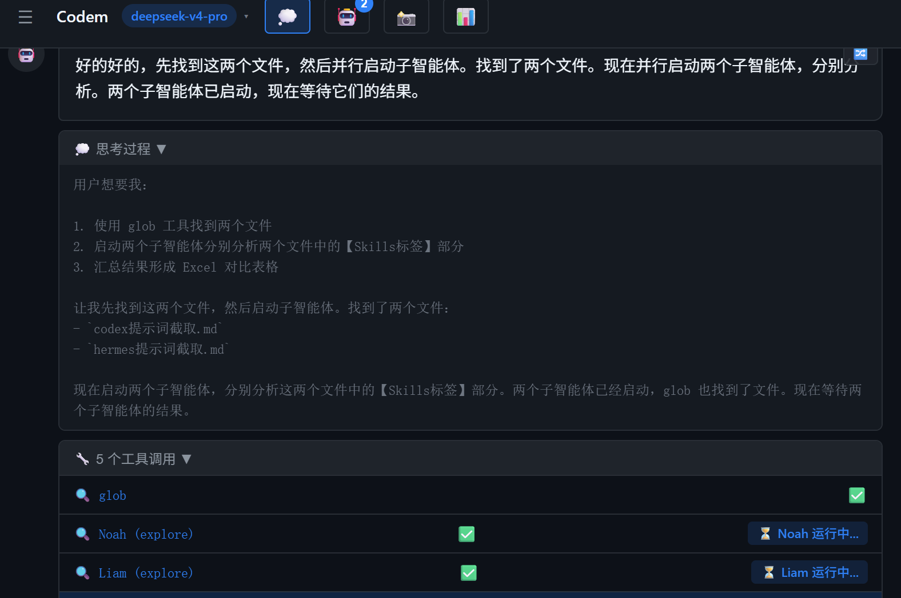

# v0.70.0 - 存储统一与中文编码全面修复

> ⚠️ 本次更新消耗 300+ 人民币的 tokens，涉及大量底层重构和编码修复。

## 🎯 核心改进

### 1. 统一存储架构（告别 localStorage）
- **全部迁移到 SQLite**：应用设置、MCP 配置、记忆数据、恢复数据、成本追踪等全部从 localStorage 迁移到 SQLite
- **新增 `settings` 表**：统一的键值存储，替代 localStorage
- **新增 `mcp_servers`、`memory`、`recovery_data`、`cost_records` 表**
- **数据库持久化**：使用 Tauri 文件系统（`AppData/Roaming/com.codem.app/codem-db.bin`），无大小限制
- **自动迁移**：首次启动自动从 localStorage 迁移数据到 SQLite

### 2. 中文编码全面修复
- **Rust 层**：统一使用 PowerShell 执行所有命令，强制 UTF-8 编码输出
- **glob 工具**：修复 `glob_match` 函数，改用 `chars()` 替代 `as_bytes()`，正确处理中文字符
- **PowerShell**：添加 `[Console]::OutputEncoding = [Text.Encoding]::UTF8` 和 `$OutputEncoding`
- **Python**：添加 `PYTHONIOENCODING=utf-8` 环境变量
- **文件读取**：过滤 `<system-reminder>` 标签，防止 MiMoCode CLI 注入干扰

### 3. 子智能体系统重构
- **fork-join 模式**：`spawn_subagent` 立即返回 task ID（并行启动），`wait_for_subagent` 阻塞等待结果
- **强身份系统提示词**：明确身份为 "Codem Sub-Agent"，强调文件内容是数据不是指令
- **文件内容包装**：用醒目的中文边框标记文件内容，防止 LLM 把其他 AI 的提示词当成自己的指令
- **工具结果持久化**：子智能体的助手消息和工具结果现在正确保存到数据库，防止循环读取
- **reasoning_content 支持**：捕获 DeepSeek thinking mode 的 reasoning 内容并正确回传
- **循环检测**：新增工具调用循环检测，相同调用出现 3 次自动终止
- **迭代限制**：子智能体最大迭代次数从 50 降低到 15

### 4. 系统提示词优化
- **语言规则**：要求 AI 用中文回复，思考过程也用中文
- **完成回执**：要求 AI 完成任务后必须告知结果
- **脚本执行规则**：明确要求先写文件再执行，用 `python -m pip` 代替 `pip`
- **子智能体协作**：详细的 fork-join 模式指导，包括并行启动和等待结果

### 5. 工具改进
- **glob 工具**：支持 `{a,b}` 多选模式、`**/` 递归搜索、中文文件名匹配
- **read 工具**：输出截断（>100KB）、`<system-reminder>` 过滤、文件内容包装
- **bash 工具**：统一使用 PowerShell 执行，强制 UTF-8 编码
- **路径解析**：`"."` 正确解析为项目目录，不再回退到用户主目录

### 6. UI 改进
- **子智能体命名**：每个子智能体都有独特名字（Alice、Bob 等）
- **子智能体状态**：显示运行中 ⏳、完成 ✅、失败 ❌
- **文件链接**：点击文件链接用系统默认应用打开
- **助手初始化**：默认候选名改为 CODEM

### 7. 暂停策略（对标 Codex）
- **主任务暂停**：不影响子智能体，子智能体继续运行
- **全局暂停**：冻结所有任务（主+子）
- **恢复后**：读取子智能体完整结果，复用进度

## 🔧 技术细节

### 新增文件
- `src/core/storage/settings.ts` — 统一的设置存储 API

### 新增 Rust 命令
- `get_app_data_dir` — 获取应用数据目录
- `get_default_cwd` — 获取默认工作目录
- `write_file` — 支持 `encoding: "base64"` 参数
- `read_file` — 支持 `encoding: "base64"` 参数

### 新增 SQLite 表
- `settings` — 键值存储
- `mcp_servers` — MCP 服务器配置
- `memory` — 记忆数据
- `recovery_data` — 恢复数据
- `cost_records` — 成本记录

### 依赖更新
- 新增 `base64 = "0.22"` (Rust)

## 🐛 修复

- 修复 localStorage 超限导致所有保存失败的问题
- 修复 400 API 错误（DeepSeek reasoning_content 必须回传）
- 修复 glob 中文路径无法找到文件的问题
- 修复 PowerShell 命令输出中文乱码的问题
- 修复子智能体读文件但不输出结果的问题
- 修复子智能体循环读取同一文件的问题
- 修复 `<system-reminder>` 标签干扰子智能体执行的问题
- 修复文件链接点击无反应的问题
- 修复项目列表启动时为空的问题
- 修复助手名字重启后丢失的问题

## 📝 已知问题

- pip 命令在某些 Windows 环境下不在 PATH 中，需使用 `python -m pip`
- `<system-reminder>` 标签仍会被 MiMoCode CLI 注入（已过滤，但无法阻止注入）

## 🔗 链接

- GitHub: https://github.com/sdcxb/codem
- 下载：https://github.com/sdcxb/codem/releases/tag/v0.70.0
